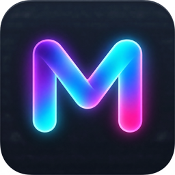
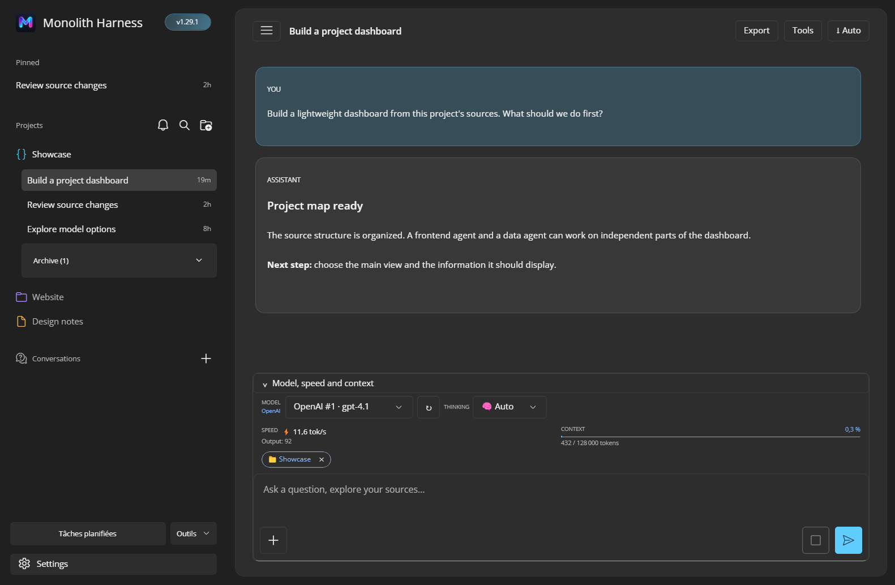
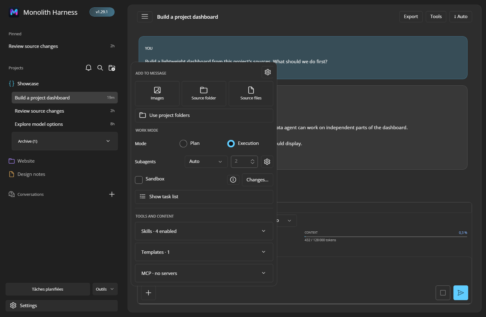
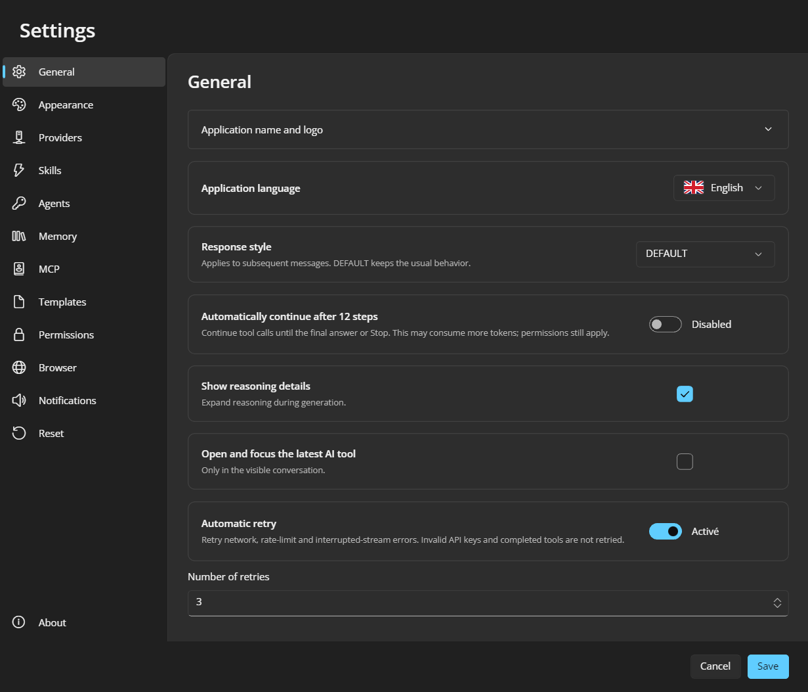
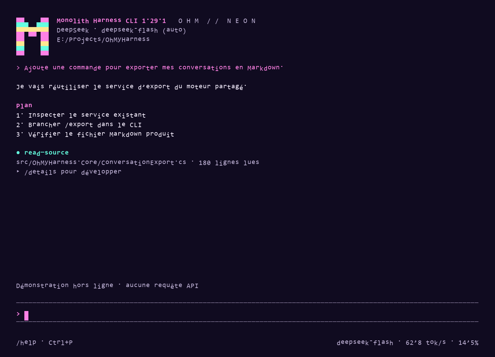
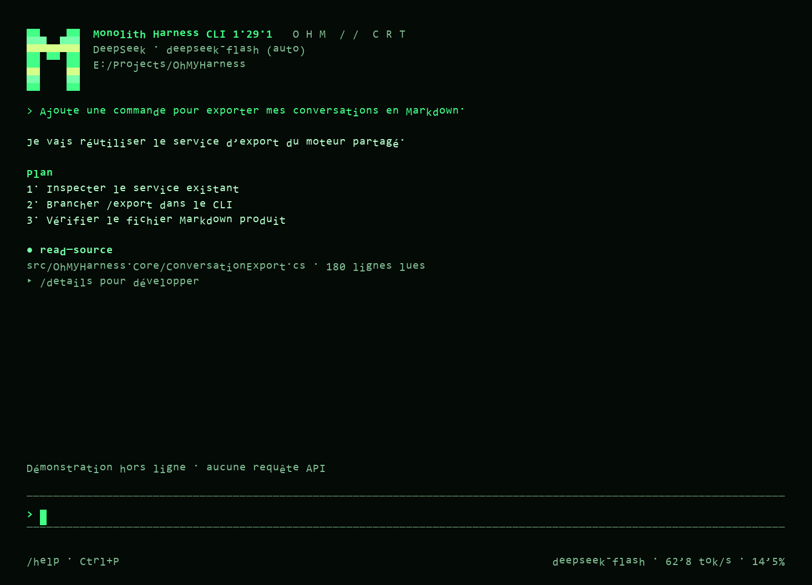
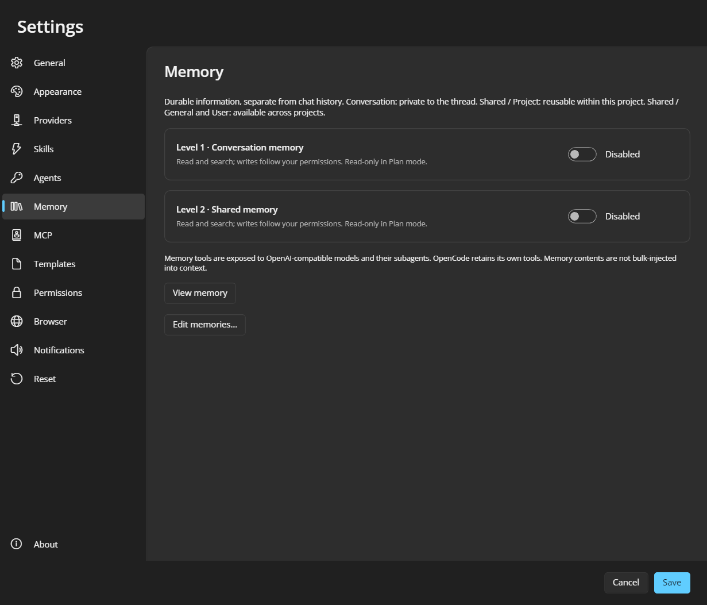

  

<h1 align="center">Monolith Harness</h1>

**Monolith Harness** publishes both interfaces as **MonolithHarness.exe** on Windows or **MonolithHarness** on Linux. Current downloads are **1.47.3**; portable data remains compatible with existing workspaces.

<strong>Your AI workspace in one portable executable — GUI or CLI.</strong>

  <a href="https://github.com/loicdelaunay/Monolith-Harness/releases/tag/v1.47.3">Download GUI</a>
  · <a href="https://github.com/loicdelaunay/Monolith-Harness/releases/tag/cli-v1.47.3">Download CLI</a>
  · <a href="#quick-start">Quick start</a>
  · <a href="#build-from-source">Build from source</a>
  · <a href="docs/guide.md">User guide</a>

**Tired of powerful AI harnesses that need a stack of configuration and external services before the first conversation? What if a portable EXE handled the workspace?**

> **No Monolith Harness account. No telemetry to a Monolith Harness service. No subscription.** Just a standalone app with its workspace beside the EXE. Model requests go to the provider you choose, which may have its own costs.
>
> **Why build it this way?** I needed something straightforward enough to use at work, without a stack of extra services. And I thought it would be nice to share it, too. :)

Monolith Harness brings projects, concurrent chats, agents, sources, tools, and settings into one application. The Windows and Linux downloads ship as self-contained executables. Put one in a writable folder, connect a model provider, and start working. Its SQLite database and application-managed resources live beside the executable, so you can move the workspace by copying the folder after closing the app.

> **Available in GUI and CLI modes.** Choose the desktop workspace or the keyboard-driven terminal experience. Both use the same .NET agent engine, portable storage, projects, and conversations. [GUI download](https://github.com/loicdelaunay/Monolith-Harness/releases/tag/v1.47.3) · [CLI download](https://github.com/loicdelaunay/Monolith-Harness/releases/tag/cli-v1.47.3) · [CLI guide](docs/cli.md)

**Make it yours:** customize the desktop **theme, displayed application name, and logo/icon** in Settings. Keep the custom image beside the executable with a relative path to retain it when moving the folder. The CLI has its own color themes, including green/amber CRT and neon styles, with live previews; terminal fonts and CRT effects use an optional host-terminal profile.

## Take a look

GUI source build 1.29.1, captured with synthetic demo data and the new M logo. Project chats, model choice, response speed, context usage, and the composer stay in view.

<table>
  <tr>
    <td width="50%">
       
      Attach sources, select Plan or Execution, configure subagents, and toggle skills.
    </td>
    <td width="50%">
       
      Language, themes, providers, permissions, MCP, and more in one settings window.
    </td>
  </tr>
</table>

### Terminal interface

The CLI offers the same conversation workflow with its own terminal themes. These images are rendered from the built-in offline demo in source build 1.29.1 with synthetic content and the new M logo; no API request was made.

<table>
  <tr>
    <td width="50%">
       
      Neon Synthwave — conversation, tool activity and composer.
    </td>
    <td width="50%">
       
      CRT Green — the same workflow in a retro terminal palette.
    </td>
  </tr>
</table>

See the two-level memory settings

## New in the current downloads

See the [changelog](CHANGELOG.md) for additions, improvements and fixes in the current releases.

## Built-in skills — one click to enable

The built-in skills and their tool implementations are written in **.NET / C# and compiled into the executable**. This keeps the core toolset fast, simple and standalone, with permission checks and Plan/Execution restrictions for controlled access. Enable a skill with **one click** in the GUI, or toggle it through `/skills` in the CLI. Some skills also need a provider or host permission configured before use.

| Skill | What it gives the agent |
| --- | --- |
| **Complete design** | Guide a project from discovery questions and ideas through technology/visual choices, optional subagents, implementation, tests and visual verification. |
| **Source exploration** | List and read project files, including focused line ranges. |
| **GIT** | Inspect repositories, stage selected files, commit and synchronize branches with approvals. See [GIT and FILE INDEX](docs/git-file-index.md). |
| **FILE INDEX** | Create a portable `index.ohm` with file/folder descriptions, search and browse it, and keep it current as files change. See [GIT and FILE INDEX](docs/git-file-index.md). |
| **Source editing** | Create, write and edit files in attached sources. |
| **Code search glob/grep** | Find files and text with line numbers. |
| **Multi-file patch with diff** | Preview and apply changes across multiple files. |
| **Terminal** | Run commands concurrently, manage terminal sessions and await results. |
| **Python scripts** | Create and execute scripts with the bundled Python runtime. |
| **Semantic search RAG** | Index and search sources using local multilingual embeddings or an API. |
| **Memory · Conversation** | Search and save facts scoped to the current conversation. |
| **Memory · Shared** | Reuse project, general and user knowledge across conversations. |
| **Bypass image AI** | Ask a dedicated vision model to describe images or identify components and coordinates. |
| **Asset generator** | Draw vector or pixel-art assets on an editable layered canvas, align with guides, animate timed frames, and export SVG, animated SVG, GIF, PNG sequences or static images. See [Asset generator](docs/asset-generator.md). |
| **Web research** | Fetch pages/APIs directly with a configurable .NET HTTP client, without a browser. Optional browser/DOM skills add rendered-page reading and interaction. See [HTTP tools](docs/web-http.md). |
| **AI browser access / DOM access** | Persist the embedded browser's AI access and interaction choices with the other skills. |
| **Application management** | List open application windows and their position and size. |
| **Mouse control** | Click, scroll or drag using screen, window or browser coordinates. |
| **Keyboard control** | Send text and key combinations to the supported desktop/browser host. |
| **Screenshots** | Capture the desktop, a specific application window or a browser page. |
| **Code review** | Guide the agent through reviewing changes and identifying issues. |
| **Planning** | Structure the work before execution. |
| **Summarization** | Produce concise summaries of useful context. |
| **Automatic skill creation** | Save reusable `SKILL.md` procedures globally or under `.omh-ai/skills` in a project. |

Custom `SKILL.md` procedures extend these compiled tools. Browser/desktop control depends on the GUI host; the CLI can use browser automation through MCP and filters unavailable desktop tools. Optional integrations keep their own prerequisites. Enabling a skill does not override permissions or provide a security sandbox; [container sandboxing](docs/sandbox.md) is a separate option.

## What is inside

| Area | Capabilities |
| --- | --- |
| **Models and providers** | Add as many OpenAI-compatible v1 or DeepSeek connections as you need, select their available models, connect OpenCode, or build a composed model with an orchestrator and specialized subagents. |
| **Projects and conversations** | Attach source folders to a project, run several chats at once, queue or steer messages while an agent works, fork or resume from an earlier message, and export a conversation to Markdown. |
| **Agent tools** | An integrated browser with controlled DOM and JavaScript access, multiple asynchronous terminals, source search and editing, a read-only Git diff viewer, file navigation, screenshots, mouse and keyboard controls, and bundled Python for scripts. |
| **Control and extensions** | Per-conversation Plan and Execution modes, optional container sandbox, scoped approval dialogs, configurable skills, project instructions from AGENTS.md, custom SKILL.md files, and MCP servers. |
| **Context that lasts** | Live token and speed indicators, context compaction, conversation and shared memory, semantic search with a bundled multilingual embedding model or an OpenAI-compatible embedding API, and an optional vision-model bridge. |
| **Desktop workflow** | Scheduled project tasks, structured agent checklists and questions, English/French UI, light/dark themes, custom app name and logo, and keyboard-friendly chat. |

Plan mode blocks modifying tools at the application boundary. The optional sandbox uses Docker or Podman and keeps a copy of approved sources separate from the real project until changes are reviewed. Permissions still apply to sensitive actions. See the [agent modes](docs/agent-modes.md) and [sandbox guide](docs/sandbox.md) for their exact boundaries.

## Quick start

1. Download the [GUI release](https://github.com/loicdelaunay/Monolith-Harness/releases/tag/v1.45.2), or choose the [CLI release](https://github.com/loicdelaunay/Monolith-Harness/releases/tag/cli-v1.45.2) for a terminal workspace. The 1.45.2 archives cover Windows x64 and Fedora Linux x64.
2. Extract the archive into a **writable folder** and run <code>MonolithHarness.exe</code> on Windows or <code>./MonolithHarness</code> on Linux. The app creates its skills folder beside the executable.
3. Open **Settings → Providers**. Add a provider and its API key or endpoint. **Test connection** detects, selects, and saves its models; you can change that selection later.
4. Create a project, attach the source folders you want to share with its chats, and start a conversation.

For the CLI, put `MonolithHarness.exe` (Windows) or `MonolithHarness` (Linux) in a writable folder, launch it from your project directory, and enter `/connect`. GUI and CLI have separate downloads. Type `/` to discover commands; use ↑/↓ and Tab to complete them. No .NET installation is required for the published executables.

The integrated browser uses the system Web engine: Edge WebView2 on Windows, WebKit on macOS and WebKitGTK on Linux. Fedora GUI needs X11 and GTK3/WebKitGTK; see the [Fedora guide](docs/fedora.md). Git, container sandboxing, OpenCode, and Chrome MCP only need installation when you enable those integrations. Scheduled tasks run while Monolith Harness is open; they do not wake a sleeping computer.

## Portable data and privacy

Monolith Harness stores <code>database.sqlite</code>, <code>skills/</code>, <code>MCP.json</code>, browser profiles, and other application-managed resources beside the executable. In a fresh folder, it creates a new database with the required schema and starter settings, without importing old conversations from AppData. EF Core applies database migrations on startup. Do not place the app in a read-only directory such as <code>Program Files</code>. Close all instances before copying the folder to another machine.

API keys use Windows DPAPI, the macOS Keychain or, on Linux, AES-GCM with an owner-only `.linux-key` file beside SQLite. On Linux, keep the entire portable folder private and copy the key with the database; anyone who can read both can recover the API keys. Windows/macOS keys are tied to the OS account and need re-entry when moving accounts or systems. The rest of SQLite is **not encrypted**. Only content used for a request is sent to its selected model provider; attaching a source folder does not upload the whole folder automatically.

The bundled RAG embedding model runs locally and supports French and English. Its model file is part of the app release. Source clones use **Git LFS** to retrieve that file.

## Platforms and building

### Terminal workspace

Monolith Harness also includes a [modern CLI](docs/cli.md) with a responsive full-screen interface, searchable commands, concurrent chats, approvals, agent questions, tools and streaming context indicators. It uses the same engine and SQLite data as the desktop app.

~~~powershell
dotnet run --project src/MonolithHarness.Cli -- "E:\Projects\MyProject"
.\publish-cli.ps1 -OutputDirectory artifacts\CLI
# Then: artifacts\CLI\MonolithHarness.exe
~~~

Use <code>MonolithHarness run "Review this project" --project . --json</code> for automation. <code>/connect</code> configures a provider, Ctrl+P opens the command palette, and <code>--database</code> selects an existing desktop workspace.

### Desktop application

The shared application is built with **Uno Platform and .NET 10**. The published Windows x64 release uses Uno Desktop; a native WinUI 3 target is also available. Automated publications currently target Windows x64 and Fedora Linux x64. macOS publication is temporarily paused; platform code and historical downloads remain available.

For a Windows source build, install the .NET 10 SDK and Git LFS. The native WinUI target additionally needs the Windows/WinUI development tools.

~~~powershell
git clone https://github.com/loicdelaunay/Monolith-Harness.git
cd Monolith-Harness
git lfs pull
dotnet run --project tests/MonolithHarness.Tests -c Release
.\publish.ps1 -OutputDirectory artifacts\GUI
~~~

Publications use `artifacts/GUI` and `artifacts/CLI`. Temporary test publications belong under `artifacts/TEMP` and should be removed after testing. Add `-NativeWinUI` to the GUI publish command to select the native WinUI target. On a Mac with the .NET 10 SDK and Xcode command-line tools, use <code>bash ./publish-macos.sh arm64</code> or <code>x64</code>; signing and notarization are separate steps.

The [Windows v1.0.0 release](https://github.com/loicdelaunay/Monolith-Harness/releases/tag/v1.0.0) passed 473 offline .NET checks and an application UI smoke scenario. The macOS target is not included in that runtime validation.

## More documentation

- [Dedicated tools](docs/model-tools.md): model-powered translator, proofreader and benchmark, available from **Tools** beside **Scheduled tasks** in the GUI.

Detailed guides: [browser, RAG, and subagents](docs/browser-rag-agents.md), [memory](docs/memory.md), [custom skills](docs/skill-authoring.md), [MCP](docs/mcp.md), [scheduled tasks and models](docs/uno-tasks-models.md), [macOS](docs/macos.md), and the [full user guide](docs/guide.md).

Monolith Harness is available under the [MIT license](LICENSE).

## Feature comparison

Monolith Harness combines a portable project workspace with dedicated visual tools: formatted translation and proofreading, model benchmarks, an asset canvas, local multilingual RAG, memory inspection, and usage charts. The table highlights that combination alongside the strengths of other harnesses.

**Scope:** Monolith Harness 1.46.0, Pi's coding agent, OpenCode's CLI/desktop app, Hermes Agent/Desktop, and **LangChain Deep Agents + Deep Agents Code**. Sources inspected on **2026-10-02**; the exact source revisions and limitations are in the [comparison notes](docs/feature-comparison.md).

**✅** Built in, with normal provider/tool configuration. **⚠️** Partial support, an extension/integration, an experimental feature, or a different workflow; the cell states the difference. **❌** No matching built-in workflow documented in the inspected sources. Extensions and custom code can change these results.

| Feature / workflow | Monolith Harness | Pi | OpenCode | Hermes Agent | Deep Agents |
| --- | --- | --- | --- | --- | --- |
| Multiple model providers and local endpoints | ✅ | ✅ | ✅ | ✅ | ✅ |
| Interactive terminal + headless automation | ✅ | ✅ | ✅ | ✅ | ✅ Code |
| Desktop GUI with projects and concurrent chats | ✅ | ❌ Terminal / SDK | ✅ Desktop | ✅ Desktop | ❌ Terminal / SDK |
| Custom skills and MCP tools | ✅ | ✅ | ✅ | ✅ | ✅ Code |
| Subagents and parallel delegation | ✅ | ⚠️ Example extension | ✅ | ✅ | ✅ |
| Curated memory across conversations | ✅ Conversation + shared | ⚠️ Context files / extensions | ⚠️ Instructions / plugins | ✅ Memory + session search | ✅ Code / SDK backends |
| Scheduled agent tasks | ✅ While app is open | ⚠️ External automation | ⚠️ External automation | ✅ Cron / gateway | ⚠️ Talon alpha |
| Telegram / Discord / WhatsApp gateway | ❌ | ❌ | ❌ | ✅ | ⚠️ Talon alpha |
| **Portable GUI + CLI workspace with data beside the launcher** | ✅ | ❌ CLI only | ⚠️ Separate data paths | ⚠️ Separate Hermes home | ❌ Python / SDK setup |
| **Conversation/shared memory editor and database viewer** | ✅ | ❌ | ❌ | ⚠️ Different memory UI / files | ⚠️ Memory files / backends |
| **Embedded multilingual semantic source search without an embedding API** | ✅ Local CPU RAG | ⚠️ Add integration | ⚠️ Add integration | ⚠️ Optional memory providers | ⚠️ Configure retrieval |
| **Formatted translator and proofreader windows** | ✅ | ❌ | ❌ | ❌ | ❌ |
| **Model benchmark UI with generated interactive-app checks** | ✅ | ❌ | ❌ | ❌ | ⚠️ Separate evaluation tooling |
| **Editable vector / pixel-art canvas, animation and GIF export** | ✅ | ❌ | ❌ | ❌ | ❌ |
| **AI-generated detector UI for text, documents and web pages** | ✅ Model / SlopTotal | ❌ | ❌ | ❌ | ❌ |
| **Usage timelines, model breakdowns and filtered CSV export** | ✅ | ⚠️ Session statistics | ⚠️ Usage / cost statistics | ⚠️ Usage / insights | ⚠️ Cost estimates / tracing |
| **Embedded browser with independent tabs per conversation** | ✅ | ⚠️ MCP / extensions | ⚠️ MCP browser tools | ⚠️ Previews / browser backends | ⚠️ Custom / MCP tools |
| **GUI GGUF import, Hugging Face downloads and engine management** | ✅ Beta | ⚠️ External llama.cpp router | ⚠️ Local endpoints | ⚠️ Canary / local flag | ⚠️ Local endpoints |
| **Local Stable Diffusion checkpoint import and managed image engine** | ✅ Beta | ⚠️ Add integration | ⚠️ Add integration | ⚠️ Image providers / skills | ⚠️ Add tools |
| **GUI updates: off / notify / install, startup + two-hour checks** | ✅ Windows install | ❌ No desktop GUI | ⚠️ Different updater | ⚠️ Package-specific updates | ❌ No desktop GUI |

Local chat/image models and their runtimes download separately. SlopTotal needs a local or remote service; detector scores are indicators, and the benchmark is a local protocol rather than an official leaderboard. Scheduled Monolith tasks require the app to remain open. See the [comparison notes and official sources](docs/feature-comparison.md) for each qualification.
