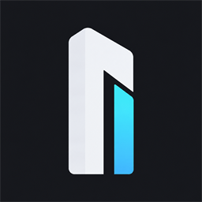
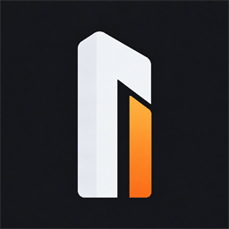
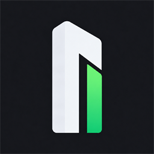

# Name, logo and Fly themes

Under **Settings → Appearance**, open **Application name and logo**:

- Enter the displayed name, up to 80 characters. An empty field restores Monolith Harness.
- The previous default application name automatically becomes Monolith Harness; other custom names are preserved.
- Choose a PNG, JPEG, WebP, BMP or ICO logo (maximum 10 MB, 4096 × 4096 pixels). A preview lets you check the image before saving.
- **Original logo** restores only the logo. **Reset name and logo** resets both fields.
- Click **Save** to apply. Cancel keeps the previous customization.

The name appears in the sidebar and titles of the main, Settings and Scheduled tasks windows. The logo appears in the sidebar and also serves as the window icon on Windows. The EXE filename and application system identity remain unchanged.

The default logo is a white architectural monolith on charcoal, selected on 2026-10-10. Version **1.84.0** distinguishes the hosts by the narrow accent plane:

| Host | Accent | Source artwork |
| --- | --- | --- |
| Desktop GUI / historical Electron host | Cyan/blue | `src/MonolithHarness.App/Assets/logo.png` / `desktop/ui/logo.png` |
| CLI | Orange | `src/MonolithHarness.Cli/Assets/logo.png` |
| Android | Green | `src/MonolithHarnessGui.Portable/Assets/logo.png` |

  

The orange and green images are precise edits of the selected artwork: the white monolith, dark background and composition remain the same. Each host owns its source image. The CLI's native Windows ICO and PNG previews use orange; its character mark uses an orange accent with the active terminal foreground. Terminal interface themes continue to control the rest of the UI. Android uses its own green source for density/adaptive launcher and startup imagery via Uno.Resizetizer. Desktop/Electron keep cyan. Custom desktop logos continue to take precedence. [Artwork prompts](logo-monolith-prompt.md).

Export all variants on Windows with `./build/update-branding-assets.ps1`. To regenerate a single host, pass `-Target Desktop`, `-Target CLI` or `-Target Android`. Optional `-SourceLogo`, `-CliSourceLogo` and `-AndroidSourceLogo` replace only the respective source. The exporter resizes existing artwork and packages native icons; it does not recolor or redesign it.

## Portable storage

`ApplicationName` and `LogoPath` are stored in the JSON settings in `database.sqlite`, without a new migration. A logo already inside the executable directory or a subfolder is referenced by a relative path, such as `my-logo.png` or `images/logo.png`.

An external logo is copied into `workspace/branding/` when saved, using a content-derived filename. Its original file is retained. On Windows, `workspace/branding/window-icon.ico` is an adapted window-icon version. Copying **the complete folder**, including the database and images, preserves these references after relocation. Relative paths resolve from the actual portable directory, even for a self-extracting EXE.

If a logo is missing or unreadable, the interface uses the original logo; Settings lets you choose a new image. Resetting does not delete image files.

## Fly dark and Fly light

Both themes are available under **Appearance → Theme**, in French and English. **Fly dark** combines a near-black background with deep-blue surfaces; **Fly light** combines a white background with neutral surfaces. Airbus blue **#00205B** marks actions and selections in both themes, without a light-blue accent. Text on blue buttons stays white for readability.

The reference color is published in the [official Airbus Brand Centre](https://www.brand.airbus.com/en/asset-library/airbus-logo). These themes are inspired by that palette; the application does not include an Airbus logo.
